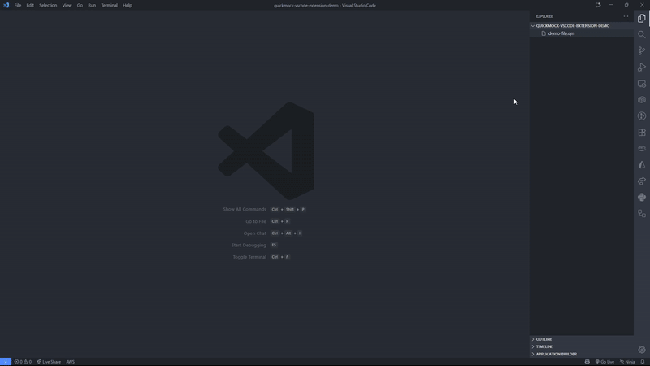

# QuickMock Wireframe Viewer

A VSCode extension to view QuickMock (.qm) wireframe files.



## ✨ Features

- Opens .qm files directly in VSCode
- Renders wireframes using React Konva
- Page navigation
- Basic zoom controls

## 🔧 Installation

Extension will be available on VSCode Marketplace (not yet published).

## 🚀 Usage

1. Open any `.qm` file in VSCode
2. Extension activates automatically

## ⚒️ Development

For development:

```bash
git clone <repository-url>
cd quickmock-vscode-extension
npm install
npm run compile
# F5 to launch extension in new VSCode window
```

### **Navigation & Controls**

- **Page Selection**: Dropdown menu in toolbar
- **Zoom Controls**: `+` / `-` buttons or `Fit` to screen
- **Document Info**: Version, page count, and canvas size display

### **Component Interaction**

Components support dynamic data through `text` and `otherProps`:

```json
{
  "type": "buttonBar",
  "text": "Save, Cancel, Apply",
  "otherProps": {
    "activeElement": 0,
    "backgroundColor": "#f0f0f0"
  }
}
```

## 📄 File Format

QuickMock files use JSON structure:

```json
{
  "version": "0.2",
  "pages": [
    {
      "id": "page-1",
      "name": "Home Screen",
      "shapes": [
        {
          "id": "uuid",
          "type": "buttonBar",
          "x": 100, "y": 200,
          "width": 300, "height": 50,
          "text": "Save, Cancel, Apply",
          "otherProps": {
            "activeElement": 0,
            "backgroundColor": "#ffffff",
            "textColor": "#333333"
          }
        }
      ]
    }
  ],
  "customColors": [...],
  "size": {"width": 3000, "height": 3000}
}
```

## ⏰ Changelog

Take a look at the [changelog of the extension](CHANGELOG.md).

## 🤝 Contributing

1. Fork the repository
2. Create feature branch (`git checkout -b feature/amazing-feature`)
3. Commit changes (`git commit -m 'Add amazing feature'`)
4. Push to branch (`git push origin feature/amazing-feature`)
5. Open Pull Request

## 📝 License

This project is licensed under the MIT License - see the [LICENSE](LICENSE) file for details.

## Acknowledgments

- Thanks to QuickMock for the wireframing tool
